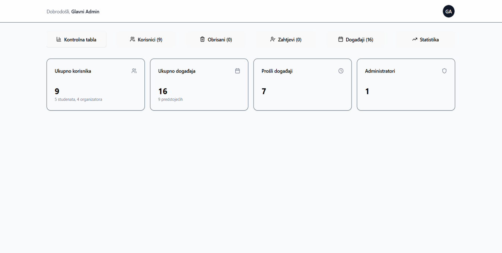
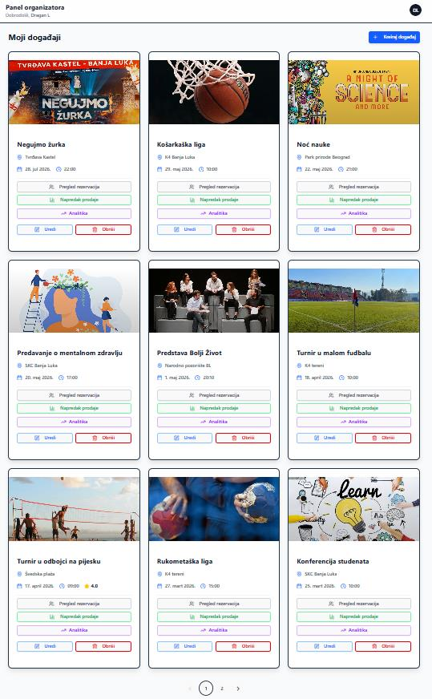
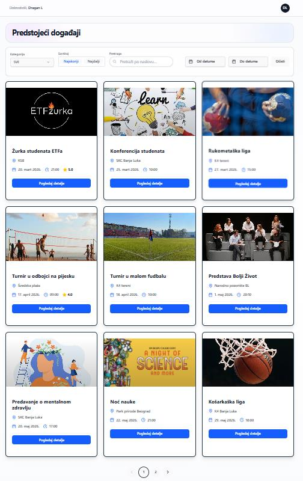

# StudLife — Event Management & Reservation System

Full-stack web platform for centralizing and managing student events at a university. Built as a team project for the Information Systems course at the Faculty of Electrical Engineering, University of Banja Luka.

## Screenshots

**Admin dashboard**


**Organizer's event management panel**


**Student event browsing view**


## About the Project

StudLife lets students discover and reserve spots at university events, while organizers create and manage those events, and administrators oversee the whole platform.

The system supports three user roles with distinct permissions:

- **Students** browse and filter available events, reserve tickets, manage their reservations, and leave ratings/reviews after attending.
- **Organizers** (approved students) create, edit, and publish events, define ticket types and pricing, and track reservations and interest.
- **Administrators** manage user accounts, approve or reject organizer requests, oversee all events, and view platform-wide statistics.

## Features

### Student
- Registration and login
- Browse and search events, filter by category and date, sort by date/relevance
- View event details and reserve tickets
- Manage (view / cancel) personal reservations
- Leave ratings and reviews for events attended

### Organizer
- Request organizer approval (role upgrade from student)
- Create, edit, and delete own events (title, date, location, description, images, ticket types, seat capacity)
- Save events as drafts before publishing
- View reservations and sales statistics per event
- Send notifications to students about new or updated events

### Administrator
- Manage user accounts (create, update, soft-delete, restore)
- Approve or reject organizer role requests
- Manage all events on the platform, including soft delete / restore
- View platform-wide activity statistics (most active users, totals, etc.)

## Architecture

Three-tier architecture: a React client, a Node.js/Express API server, and a MySQL database, communicating over a REST API with JSON payloads. Keeping the client without direct database access improves security and allows the frontend and backend to evolve independently.

```
Presentation layer   →  React client (UI + client-side logic)
Application layer     →  Express REST API (business logic, auth, RBAC)
Data layer            →  MySQL database
```

Authentication and authorization are handled via **JWT**, with **Role-Based Access Control (RBAC)** distinguishing Student, Organizer, and Administrator permissions on every protected route. Passwords are hashed with **BCrypt** before being stored.

## Technologies

### Frontend
- React, JavaScript, Vite, HTML, CSS

### Backend
- Node.js, Express.js, REST API, JWT authentication

### Database
- MySQL (hosted on Aiven cloud in production)

### Testing
- Vitest, SuperTest — separate **unit** and **integration** test suites (auth, reservations, comments, email service, security checks), with coverage reporting via `npm run test:coverage`

### Other Tools
- Git, GitHub, npm

## Application Structure

```
StudLife/
├── frontend/
│   ├── src/
│   └── public/
│
├── backend/
│   ├── routes/
│   ├── controllers/
│   ├── middleware/
│   ├── utils/
│   └── tests/
│       ├── unit/
│       └── integration/
│
└── README.md
```

## Getting Started

### Prerequisites
- Node.js and npm
- MySQL

### Setup

```bash
# Backend
cd backend
npm install
npm run dev

# Frontend (in a separate terminal)
cd frontend
npm install
npm run dev
```

Configure your database connection and JWT secret via environment variables in `backend/.env` (see `backend/.env.test.example` for the expected variables).

### Running tests

```bash
cd backend
npm run test:unit          # unit tests only
npm run test:integration   # integration tests only
npm run test:coverage      # full suite with coverage report
```

## Team

Built by: Vedran Topić, Milena Vrakelja, Dragan Latinović, Ivana Mitošević

## Author of this repository

**Vedran Topić** — [github.com/vedrantopicc](https://github.com/vedrantopicc)
